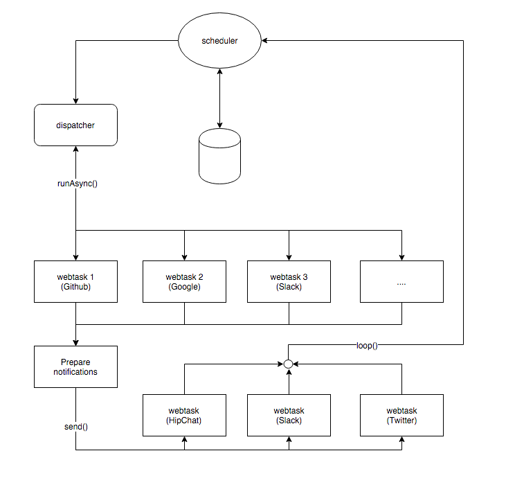

# Backendless MFA monitoring

Monitor your online applications without worrying about the hosting platform, bills, and servers. Run simple crontab task to oversee the actual state of the MFA (Multi-Factor Authentication) among different services like **Github**, **Google**, **Slack** and more.


## Requirements

- Node.JS (>= 5.0.0) and NPM installed
- Webtask CLI - [https://webtask.io/cli](https://webtask.io/cli)
- Webtask.io account (free) - [webtask.io](https://webtask.io)

## Installation

```bash
npm install
npm run start
```

To get the newest code and update current installation:

```bash
git fetch --all
git pull
npm run install
```

## Configuration and update

Configuration process allows modifying settings for individual components without starting from scratch. Settings are stored inside `build` directory as `config.json` file.


Available commands are:

```
npm run start - fully automated process, configure, build, install

npm run build - build all tasks
npm run build:webtasks - build only webtasks

npm run configure - configure all tasks
npm run configure:cron - configure only cron settings
npm run configure:sandbox - configure sandbox settings
npm run configure:webtasks - configure webtasks settings

npm run install - install all
npm run install:cron - install scheduled webtask
```


## Compatibility

It works with every service with an API access to information about the MFA state for particular accounts. Feel free to create a new connector and share with people by sending the pull request.

## Architecture

This project leverages the quality of [webtask.io](https://webtask.io) platform created by [auth0](https://auth0.com/) which allows running Node.JS code inside an isolated environment. It is fast, secure, reliable and **FREE**.




## License

MIT.
